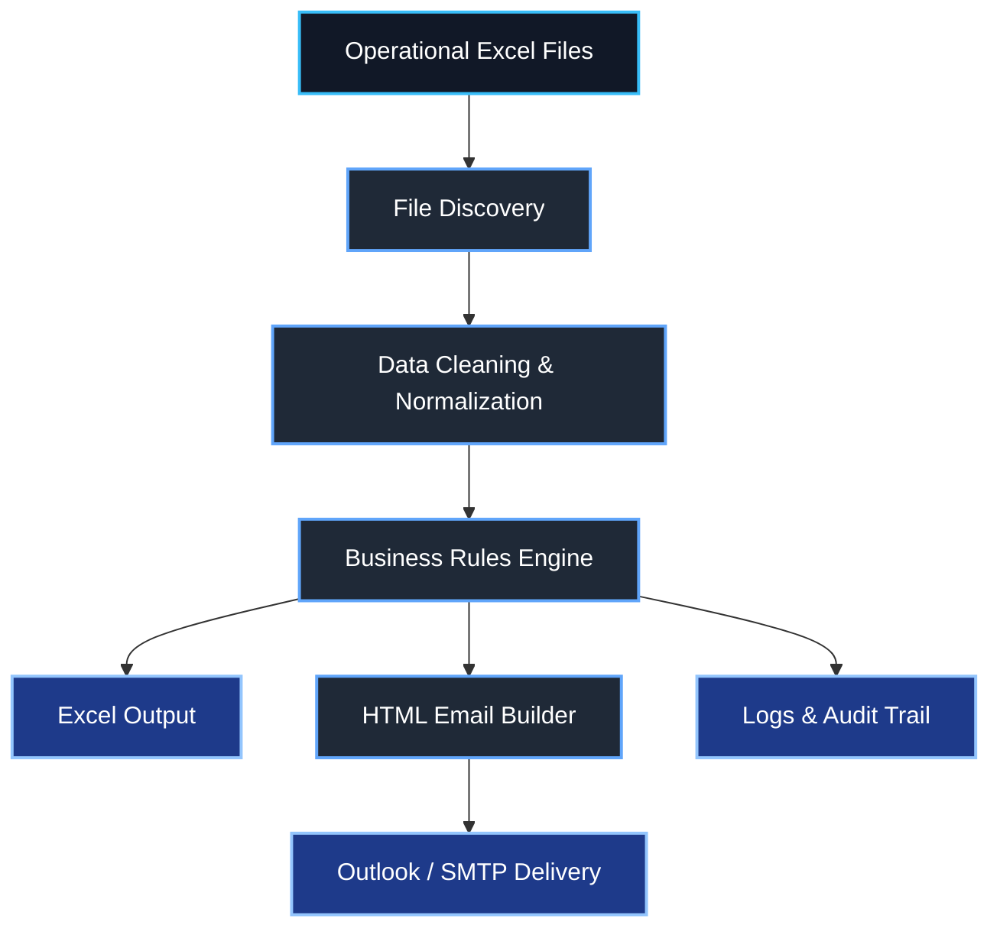
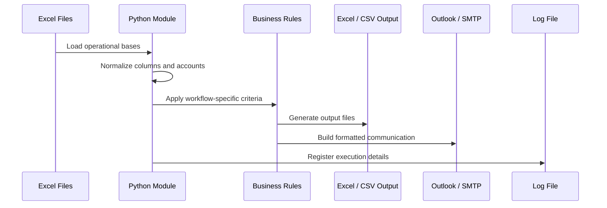
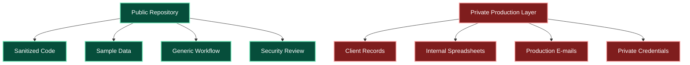

# Financial Automation Suite

<p align="left">
  
  
  
  
  
</p>

Public-safe version of a financial operations automation suite built to reduce manual work across Excel-based reports, advisor communications, margin monitoring, balance alerts, maturity tracking, profitability emails, NPS workflows and corporate operations.

The project demonstrates how Python can be used to connect spreadsheets, operational rules, logs, formatted e-mails and reporting outputs into reusable automation modules for investment-related workflows.

> This repository is a sanitized public version. It does not contain real client data, private spreadsheets, production e-mails, internal file paths, credentials, API keys or confidential business information.

---

## Overview

Financial operations teams often depend on repetitive Excel workflows, manual e-mail preparation, cross-checking account data, reading multiple base files and distributing information to advisors or internal teams.

This project groups multiple automations into a single suite focused on:

- Reading and validating Excel files;
- Merging operational bases;
- Detecting exception cases;
- Generating clean output spreadsheets;
- Creating advisor-specific reports;
- Sending or preparing formatted e-mails;
- Producing logs for auditability.

The core automation pattern is:



---

## Problem

Before automation, many operational routines require manual steps such as:

- Opening several Excel files every day;
- Filtering accounts, advisors and balances;
- Checking margin calls and negative balances;
- Identifying idle cash or relevant maturities;
- Building e-mails manually;
- Copying tables into Outlook;
- Tracking errors without a standard log;
- Repeating the same process across multiple advisors.

This increases operational risk, consumes time and makes it harder to scale daily routines.

---

## Solution

This repository organizes those workflows into reusable Python modules.

The suite supports:

- Margin alert automation;
- Desk-client balance monitoring;
- Idle cash detection;
- Advisor maturity reports;
- Advisor profitability communication;
- Corporate workflow e-mails;
- NPS response processing;
- Generic HTML e-mail sender tools;
- Shared utilities for logging, formatting, Excel reading and account normalization.

---

## Key Features

| Feature | Description |
|---|---|
| Excel-Based Input | Reads operational files such as balances, movements, advisor bases and control spreadsheets. |
| Account Normalization | Handles account numbers coming from Excel as text, float or numeric values. |
| Advisor Mapping | Merges operational records with advisor/e-mail mapping tables. |
| Business Rule Filters | Applies thresholds such as negative balances, idle cash, maturity dates or margin events. |
| HTML Table Builder | Generates clean HTML tables for e-mail communication. |
| Outlook Integration | Public-safe structure for Outlook-based e-mail workflows. |
| SMTP Integration | Public-safe structure for SMTP-based e-mail workflows. |
| Audit Logs | Creates logs and error files for operational review. |
| Public-Safe Design | Removes private paths, e-mails, credentials and real data from the public version. |

---

## Repository Structure

```text
financial-automation-suite/
│
├── shared/
│   ├── config.py
│   ├── excel_utils.py
│   ├── email_utils.py
│   └── logging_utils.py
│
├── margin_alerts/
│   └── margin_alerts.py
│
├── desk_balance_alerts/
│   └── desk_balance_alerts.py
│
├── idle_cash_alerts/
│   └── idle_cash_alerts.py
│
├── advisor_maturities/
│   └── advisor_maturities.py
│
├── advisor_profitability/
│   └── advisor_profitability.py
│
├── corporate_workflow/
│   └── corporate_workflow.py
│
├── nps_automation/
│   └── nps_responses.py
│
├── outlook_html_tools/
│   └── outlook_html_sender.py
│
├── docs/
│   ├── architecture.md
│   ├── module_map.md
│   └── security_review.md
│
├── samples/
│   ├── sample_accounts.csv
│   ├── sample_advisors.csv
│   ├── sample_balances.csv
│   ├── sample_movements.csv
│   └── README.md
│
├── .env.example
├── .gitignore
├── .gitattributes
├── requirements.txt
├── requirements-windows.txt
├── LICENSE
└── README.md
```

---

## Main Modules

### `margin_alerts/margin_alerts.py`

Detects margin-related movements, groups exposure by account and prepares advisor/internal alert outputs.

### `desk_balance_alerts/desk_balance_alerts.py`

Crosses monitored desk clients with account balances and identifies relevant positive balances and negative balances.

### `idle_cash_alerts/idle_cash_alerts.py`

Detects accounts with idle cash above a configurable threshold and prepares advisor-facing outputs.

### `advisor_maturities/advisor_maturities.py`

Consolidates fixed income and structured product maturities by advisor.

### `advisor_profitability/advisor_profitability.py`

Prepares advisor-level profitability communication from spreadsheet inputs.

### `corporate_workflow/corporate_workflow.py`

Automates corporate workflow communication based on control spreadsheet data.

### `nps_automation/nps_responses.py`

Processes NPS-like responses using environment-based credentials only. The public version does not include any production credentials.

### `outlook_html_tools/outlook_html_sender.py`

Generic utility for sending or previewing HTML e-mails through Outlook.

---

## Data Flow



---

## Technologies Used

| Category | Technologies |
|---|---|
| Language | Python |
| Data Processing | Pandas, NumPy |
| Excel Files | OpenPyXL |
| E-mail Automation | Outlook COM, SMTP |
| Windows Automation | PyWin32 |
| HTML Output | Inline HTML/CSS tables |
| Logging | Python logging module |
| Configuration | Environment variables |

---

## Installation

Create a virtual environment:

```bash
python -m venv .venv
```

Activate it on Windows:

```bash
.venv\Scripts\activate
```

Install core dependencies:

```bash
pip install -r requirements.txt
```

For Outlook/Windows automation:

```bash
pip install -r requirements-windows.txt
```

---

## Environment Variables

A safe example file is included:

```text
.env.example
```

Example configuration:

```env
APP_ENV=local
INPUT_DIR=./samples
OUTPUT_DIR=./output
LOG_DIR=./logs

SEND_EMAILS=false
PREVIEW_EMAILS=true

OPERATIONS_EMAIL=operations@example.com
DEFAULT_CC_EMAILS=team@example.com

SMTP_SERVER=smtp.example.com
SMTP_PORT=465
SMTP_USER=replace-with-user
SMTP_PASS=replace-with-password
```

Production credentials, private e-mails and internal paths must never be committed to the repository.

---

## Running Examples

### Margin Alerts

```bash
python margin_alerts/margin_alerts.py \
  --movements ./samples/sample_movements.csv \
  --advisors ./samples/sample_advisors.csv \
  --output ./output/margin_alerts.xlsx
```

### Desk Balance Alerts

```bash
python desk_balance_alerts/desk_balance_alerts.py \
  --accounts ./samples/sample_accounts.csv \
  --balances ./samples/sample_balances.csv \
  --advisors ./samples/sample_advisors.csv \
  --output ./output/desk_balance_alerts.xlsx
```

### Idle Cash Alerts

```bash
python idle_cash_alerts/idle_cash_alerts.py \
  --balances ./samples/sample_balances.csv \
  --advisors ./samples/sample_advisors.csv \
  --output ./output/idle_cash_alerts.xlsx
```

---

## Business Impact

This type of automation can generate meaningful operational gains:

| Impact Area | Result |
|---|---|
| Manual Work Reduction | Reduces repetitive Excel filtering and e-mail preparation. |
| Operational Control | Standardizes daily checks and alert rules. |
| Speed | Generates outputs and communications faster. |
| Error Reduction | Reduces manual copy/paste and formatting mistakes. |
| Advisor Support | Creates clearer advisor-specific information. |
| Auditability | Produces logs and output files for review. |
| Scalability | Allows more accounts, advisors and workflows to be monitored with less manual effort. |

---

## Public-Safe Scope

This repository focuses on the architecture and implementation pattern.

It intentionally excludes:

- Real client data;
- Real advisor data;
- Internal spreadsheets;
- Production e-mails;
- Private file paths;
- Credentials;
- API keys;
- Confidential business rules.



---

## Status

Public-safe portfolio version.

The repository demonstrates the technical design and implementation approach without exposing confidential data, production credentials or internal files.

---

## Author

**Lucas Daniel de Oliveira Morandi**

Financial markets professional focused on automation, business intelligence, data workflows and operational efficiency for investment-related processes.
